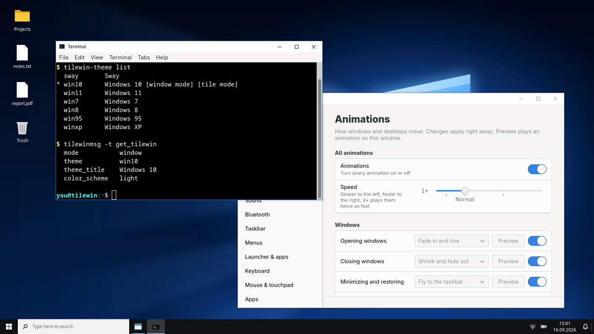
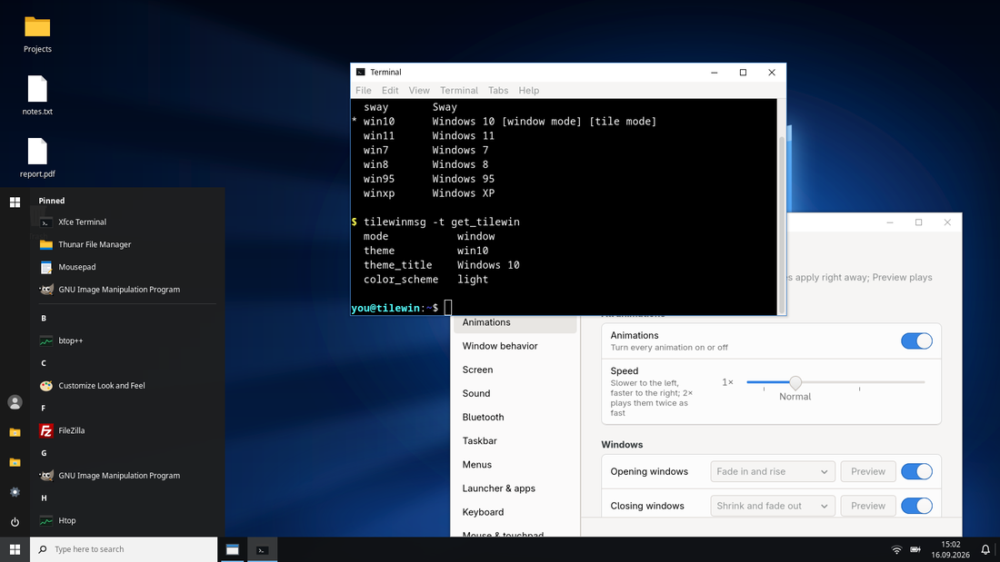
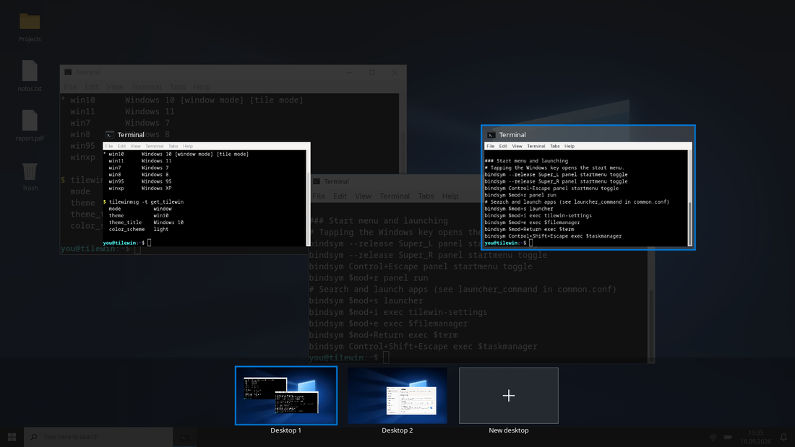
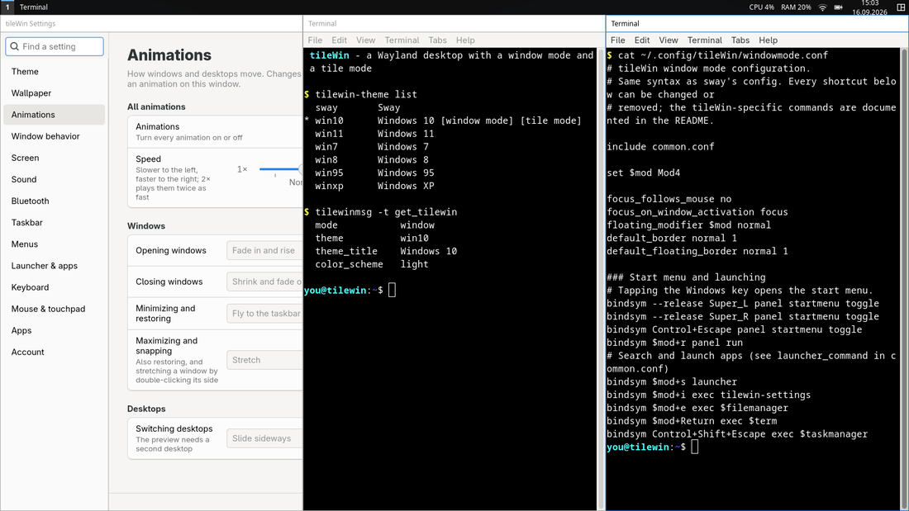
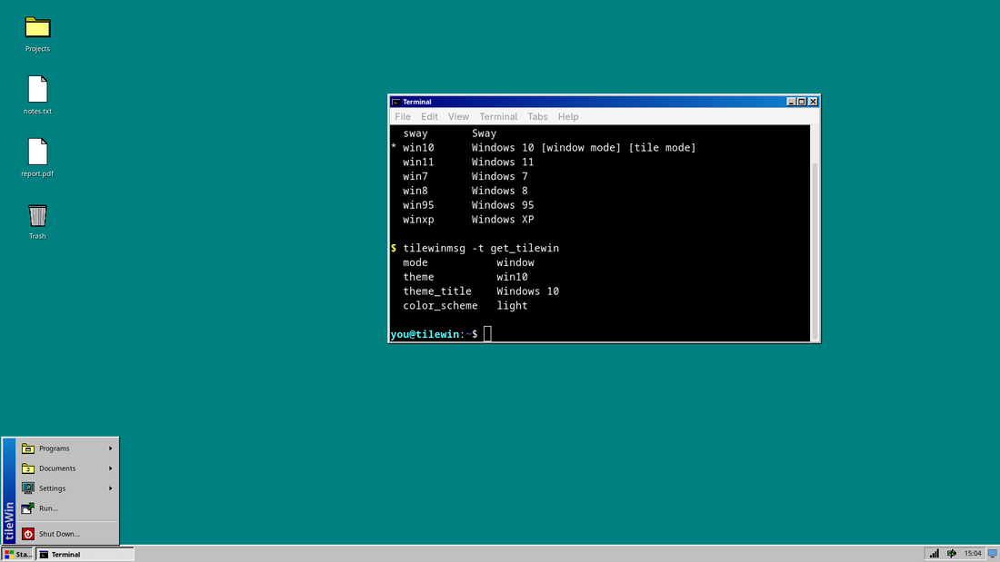
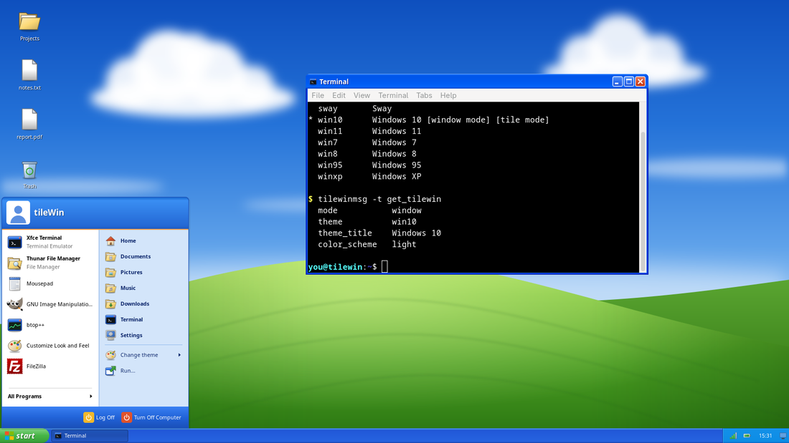
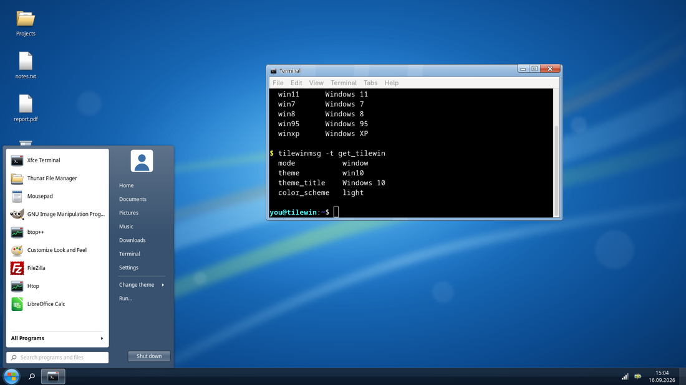
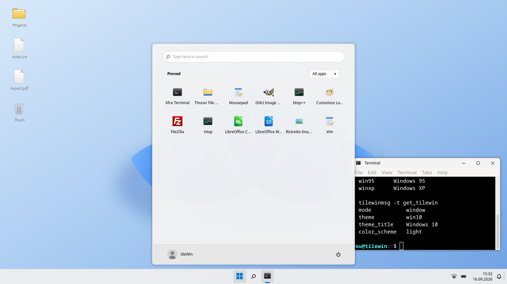
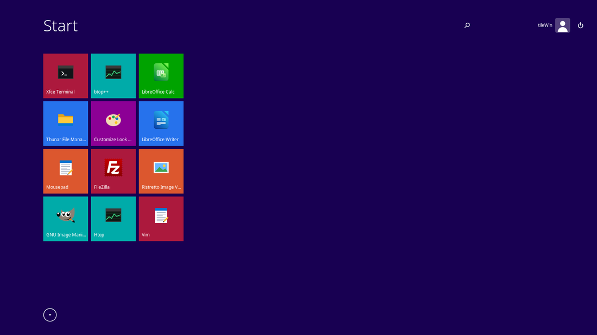
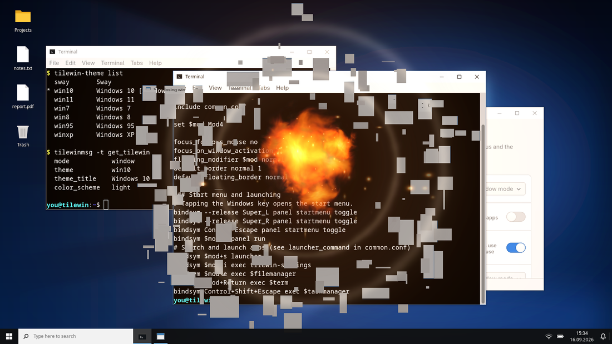

# tileWin

tileWin is a Wayland compositor with two modes you can switch between at any time:

- **Tile mode:** behaves like [sway](https://swaywm.org) and is configured with the same syntax. Your sway config works here.
- **Window mode:** behaves like Windows:
  - floating windows with themed title bars and minimize/maximize/close buttons
  - drag-to-edge snapping, Alt+Tab and Windows keyboard shortcuts

It comes with **tilewin-panel**, a lightweight taskbar with widgets, custom script widgets, right-click menus and a start menu. There are seven built-in themes: **Windows 95, XP, 7, 8, 10, 11** and **sway**. They style window decorations, taskbar, start menu, menus and wallpaper, and switch live from the command line.

tileWin is built on sway 1.12 and wlroots 0.20. The compositor and taskbar are written in C without GTK/Qt and use no CPU when idle; only the optional settings app uses GTK4 and runs only while it is open.

## Screenshots

Window mode with the Windows 10 theme: floating windows with title bars, the taskbar with tray and clock, desktop icons, and the settings app.



| Start menu | Task view (Super+Tab) |
|---|---|
|  |  |

Tile mode is sway: the same layouts, the same config, with the theme's tile colors and a status bar.



Every theme brings its own title bars, taskbar, start menu and wallpaper:

| Windows 95 | Windows XP |
|---|---|
|  |  |
| **Windows 7** | **Windows 11** |
|  |  |

Windows 8 replaces the start menu with a full-screen start screen of colored tiles:



Windows can be closed with an explosion (`animation close explode`), one of the styles on the Animations page:



## Features

- **Two live-switchable modes.** `Super+Shift+W` or `tilewinmsg mode toggle`.
  - Windows keep running.
  - Tiled windows become floating windows and get their previous window-mode geometry back when you return.
- **Window mode:**
  - Themed server-side decorations with hover and pressed states.
  - Double-click the title bar to maximize; double-click the icon to close. `double_click_time` sets how fast the two clicks have to follow each other.
  - Resize from the borders (with invisible grab margins on thin-border themes).
  - Drag to a screen edge to snap left/right, drag to a corner for quarters, drag to the top edge to maximize. A preview shows first.
  - `Super+Arrow` snapping.
  - Moved and resized windows stick to the edges of other windows and of the screen. Hold Shift (`window_group_modifier`) while dragging to move the windows touching it along. Windows snapped to an edge or a corner belong to such a group as well: they come along in the size they have, instead of going back to the size they had before they were snapped.
  - Double-click the left or right side of a window to stretch it to the next window or the screen edge, the top or bottom side to do the same with its height. Double-click again for the old size.
  - Minimize to the taskbar; show desktop; Alt+Tab switcher, as a grid of icons or as a 3D stack of the windows themselves like Flip 3D (`alttab { style flip3d }`, used by the Windows 7 theme).
  - Closing a window gives the focus to the window used before it that is open on the same desktop and not minimized, so a minimized window is not opened again.
  - Task view (Win+Tab) like on Windows 10: thumbnails of the windows, a strip with all desktops (workspaces) to switch to, drag windows onto a desktop or "New desktop", close windows and desktops. Hovering a desktop shows its windows; arrow keys and Enter pick a window. Desktops created there stay when they are empty.
  - Arrange windows: cascade, stacked, side by side, optimal grid.
- **Tile mode:** everything sway does.
- **Taskbar:**
  - Separate layouts for window mode and tile mode.
  - Widgets:
    - Apps and windows: start button, taskbar, quick launch, workspaces, window title.
    - Status: system tray (StatusNotifierItem, with the menus the icons publish over DBusMenu), clock with the clock and calendar flyout, volume, network, battery, CPU, memory, disk activity, brightness, keyboard layout.
    - Controls: mode switch, show desktop, search box.
    - Layout and scripts: separator, spacer, **custom script widgets**.
  - Every widget can run commands on click or scroll and have its own right-click menu.
- **Start menu** in the style of the active theme:
  - Windows 95: cascading menu with banner.
  - XP / 7: two-column menu.
  - Windows 10: list.
  - Windows 11: centered grid.
  - Windows 8: a full-screen start screen with colored tiles, all apps in columns and search.
  - All include app search, pinned apps, places and a power menu.
- **Run dialog**, tooltips, calendar flyout.
- **Desktop** like on Windows: icons of the files in `~/Desktop` (double-click opens them) and a right-click menu to create folders, text documents and shortcuts to programs, files or web addresses, rename or delete (to the trash) items, open a terminal there, and change the wallpaper or theme. Drag icons to any cell of the grid; where they sit is kept in `~/.local/state/tileWin/desktop-icons`, and "Sort icons" puts them back in order. Dragging one of several selected icons moves them all and keeps the places they have next to each other. Drag on the empty desktop to draw a selection rectangle, and Ctrl+click to add or remove single icons. Clicking the desktop gives it the keyboard: **Delete** moves the selected icons to the trash (where there is none, it asks whether to delete it for good), **F2** renames the one selected icon, **F5** rereads the folder and **Escape** drops the selection. Shortcuts of other desktops work too, including KDE's `Type=Link` files such as the trash can. Turn the icons off with `desktop_icons no` in `taskbar.conf`.
- **Flyouts** like on Windows: click the network icon for Wi-Fi networks (connect with password, disconnect, Wi-Fi on/off), the volume icon for the volume, output device and per-app volumes, and the battery or brightness icon for charge, remaining time, brightness and power mode.
- **Shut down dialog** in the look of the theme, opened from the start menu or with Ctrl+Alt+Delete: Windows 95 asks "Shut Down Windows" with radio buttons over the dithered screen, Windows XP shows "Turn off computer" with Stand By, Turn Off and Restart while the screen fades to gray (and "Log Off Windows" from Log Off), Windows 7, 10 and 11 show the Ctrl+Alt+Delete screen over the blurred desktop, and the Sway theme big buttons like wlogout. The commands are the `power` entries of the `startmenu` block.
- **Text fields** (start menu search, launcher, Run dialog, desktop dialogs, Wi-Fi password) edit like on Windows: ←/→ move the cursor (Ctrl: by word), Home/End, Shift with any of them selects, Ctrl+A selects everything, typing replaces the selection and Backspace/Delete remove it (Ctrl: a word). Themes can color the selection with `text { selection_bg; selection_fg }`.
- **Lock screen** (Win+L): `tilewin-lock` shows the wallpaper with the time and date like Windows; any key shows the sign-in view with your picture (`~/.face`), name and password. The password is checked with PAM (`/etc/pam.d/tilewin-lock`, installed by install.sh). If the lock screen crashes, the session stays locked. `tilewin-lock -f` returns once the session is locked (for scripts and `lock_command`).
- **Theme icons in other apps:** Thunar, Dolphin, Nautilus, file dialogs and other GTK, KDE and Qt apps show the icons of the theme too, e.g. Windows XP folders and files (see [Icons](#icons)).
- **Themes:** switch with `tilewin-theme set <name>`. Create your own themes, inheriting from the built-in ones.
- **Dark mode:** `tilewin-theme scheme dark` (or the switch in tileWin Settings) gives every theme dark title bars, menus, flyouts and start menu, and switches GTK, GNOME (and Qt apps through the desktop portal) and KDE apps to dark as well.
- **Session restore:** the apps open at shutdown or logout start again at the next login, on the same workspace and position. Terminals (xfce4-terminal, GNOME Terminal, Konsole, kitty, Alacritty, foot, …) reopen in the directory their shell was in, and file managers (Thunar, Dolphin, Nautilus, Nemo, Caja, PCManFM) reopen the folder that was shown; tileWin switches Thunar, Dolphin and Nemo to show the full path in the window title for this. Apps that save their own state (browsers, editors) bring back their content. Turn it off with `session_restore no`.
- **Reload without logging out:**
  - `reload`: config.
  - `restart panel`: taskbar only.
  - `restart`: the whole compositor, e.g. after an update. The session stays open, and `relaunch-apps` starts your apps again.
- **Settings app** (`tilewin-settings`, GTK4, Super+I): theme and mode, wallpaper per theme or for all themes, taskbar layout and widgets, right-click and start menus, application launcher and default programs.
- **Fish completions** for `tilewinmsg` (including all tileWin commands and theme names), `tilewin`, `tilewin-theme`, `tilewin-panel` and `tilewin-settings`.
- **Low resource use:**
  - Decorations are drawn once and cached.
  - The panel is event-driven, redraws only on change and polls system information only for widgets that are visible.

## Installation

```sh
git clone <this repository> tileWin
cd tileWin
./install.sh              # installs dependencies (pacman/apt/dnf), builds and installs to /usr/local
```

Options:

| Option | Effect |
|---|---|
| `--prefix <dir>` | Installation prefix (default `/usr/local`) |
| `--no-deps` | Skip installing dependencies |
| `--debug` | Debug build instead of the optimized LTO release build |
| `--destdir <dir>` | Stage the install into a directory (packaging) |
| `--no-user-config` | Don't create `~/.config/tileWin` |
| `--uninstall` | Remove the installation |

The installer:
- creates `~/.config/tileWin/` with the default config files if they don't exist yet
- registers the **tileWin** session for display managers

Start tileWin:
- choose "tileWin" in your display manager (GDM, SDDM, ly, greetd, ...), or
- run `tilewin-session` from a text console.

**Dependencies:**
- **Required:** wlroots 0.20, wayland, wayland-protocols, libinput, libxkbcommon, libevdev, pixman, libdrm, cairo, pango, gdk-pixbuf2, librsvg, json-c, pcre2, xcb-util-wm, Xwayland, systemd-libs (sd-bus, for the tray), meson and ninja.
- **Optional:** pam (the lock screen is skipped without it), gtk4 (the settings app is skipped without it), grim, slurp and wl-clipboard (screenshots and the snipping tool), pavucontrol/pactl (volume widget), xfce4-terminal and thunar (the default terminal and file manager in the configs), swaylock.

### Updating

```sh
git pull && ./install.sh --no-deps && tilewinmsg restart
```

`restart` replaces the running compositor with the newly installed one without ending your session. Wayland apps cannot survive a compositor restart, so use `tilewinmsg restart relaunch-apps` to have your apps started again and placed where they were. If only the taskbar changed, `tilewinmsg restart panel` is enough.

## Configuration

All configuration lives in `~/.config/tileWin/` and is plain text:

| File | Purpose |
|---|---|
| `common.conf` | Settings shared by both modes: programs, outputs, inputs, wallpaper, autostart |
| `tilemode.conf` | Tile mode: a normal sway config (`man 5 sway`) |
| `windowmode.conf` | Window mode: same syntax, with Windows-style shortcuts |
| `taskbar.conf` | Taskbar layouts, widgets, menus and start menu |
| `current-theme` | Name of the active theme (managed by `tilewin-theme`) |
| `themes/<name>/` | Your own themes |

Both mode configs `include common.conf`. Missing files fall back to the installed defaults in `/usr/local/share/tileWin/config/`. Reload with `Super+Shift+C` or `tilewinmsg reload`. The taskbar reloads its config automatically when you save it.

### Default window mode shortcuts

| Keys | Action |
|---|---|
| Super (tap) / Ctrl+Esc | Start menu |
| Super+R | Run dialog |
| Super+S | Application launcher |
| Super+I | tileWin Settings |
| Super+E | File manager |
| Super+Return | Terminal |
| Super+D, Super+M | Show desktop |
| Super+L | Lock |
| Super+↑ / ↓ / ← / → | Maximize / restore or minimize / snap left / snap right |
| Alt+Tab, Alt+Shift+Tab | Switch windows (release Alt to confirm, Esc to cancel) |
| Super+Tab | Task view: windows and desktops; drag windows onto another or a new desktop |
| Super+Ctrl+D, Super+Ctrl+F4 | New desktop, close the current desktop |
| Super+Alt+← / → | Move the current desktop left / right in the order |
| Alt+F4 | Close window |
| Alt+Space | Window menu |
| Ctrl+Shift+Esc | Task manager |
| Super+1..9 | Activate the n-th taskbar entry |
| Super+Ctrl+← / → | Previous / next virtual desktop |
| Super+Ctrl+Shift+← / → | Move window to previous / next desktop |
| Super+Shift+← / → | Move window to another monitor |
| Print | Screenshot of all screens to the clipboard and ~/Pictures/Screenshots |
| Win+Shift+S | Snipping tool: rectangle, window or full screen to the clipboard |
| Super+Shift+W | Switch to tile mode |
| Super+Shift+C | Reload config |
| Super+Shift+Ctrl+R | Restart tileWin |
| Super+Shift+Ctrl+P | Restart the taskbar |
| Ctrl+Alt+Del | Shut down dialog: shut down, restart, sleep, lock or log out |
| Win+Page Up / Win+Page Down | Maximize / minimize the window |
| Win+A / Win+N | Quick settings / notifications (Action Center) |
| Win+V | Clipboard history |
| Three fingers up / down on the touchpad | Task view / show the desktop |
| Three fingers left / right on the touchpad | Next / previous desktop |

Tile mode uses sway's default bindings (`$mod` = Super, `$mod+d` opens the launcher) plus `Super+Shift+W` to switch mode, `Super+Shift+Ctrl+R` to restart and the three finger swipes (up: task view, left / right: workspaces).

Configs from before the gestures get them added on start unless they already bind a three finger swipe (`bindgesture swipe:3:…`); an `unbindgesture swipe:3:up` line removes one again.

### Volume, brightness and media keys

The volume, microphone mute, brightness and media player keys work in both modes (also on the lock screen) and show a popup like on Windows. A `bindsym` for the same key in your config replaces the default.

The same can be done from a terminal with `tilewin-media`:

```sh
tilewin-media                  # show volume, microphone, brightness and music
tilewin-media volume up        # louder (volume down: quieter)
tilewin-media volume 40        # set the volume to 40%
tilewin-media mute             # mute or unmute
tilewin-media mic              # mute or unmute the microphone
tilewin-media brightness 70    # set the brightness to 70% (up, down, +10, -10)
tilewin-media play             # play or pause (next, previous, stop)
tilewin-media help             # all examples
```

It uses `wpctl`, `pactl` or `amixer` for audio, `brightnessctl` or `light` for the backlight and `playerctl` for music and video players. The popup can also be shown on its own with `tilewinmsg panel osd volume|brightness <percent>`, `panel osd mic <muted>` or `panel osd media`.

### Notifications and the Action Center

The taskbar is the notification service of the desktop (`org.freedesktop.Notifications`), so `notify-send` and apps show their notifications on it. They pop up above the notification area as toasts (Windows 10 and 11) or balloons (95, XP and 7) and then go to the Action Center: the bell button next to the clock, `Win+N` or `tilewinmsg panel notifications`.

- Click a notification to open the app, use its buttons, or close it with ×. Hovering keeps it on screen.
- The Action Center groups the history by app (kept across restarts, up to 50), with *Clear all* and a *Do not disturb* switch. Do not disturb (`panel dnd on|off|toggle`) only lets urgent notifications pop up.
- If another notification daemon (mako, dunst, …) is running, tileWin waits and takes over when it quits.
- Theme keys: `notifications.style toast|balloon`, `notifications.center side|flyout`, `notifications.bg`, `.fg`, `.border`, `.badge`.
- Configs from older versions get the bell button after the clock; `notifications_button no` in taskbar.conf keeps it away (the Settings app writes this when you remove it).

### Quick settings

`Win+A` (or `tilewinmsg panel quicksettings`) opens quick settings like on Windows 11: buttons for Wi-Fi, Bluetooth, airplane mode, do not disturb, night light and tile mode, sliders for volume and brightness, the battery and a link to the settings. The arrows next to Wi-Fi, Bluetooth and the volume open their own flyouts. In the Windows 11 theme the network, volume and battery icons of the taskbar open it too (theme key `panel.quick_settings`, or `quick_settings yes|no` on those widgets).

Wi-Fi uses NetworkManager (`nmcli`), airplane mode `rfkill`, the volume `pactl`, the brightness `brightnessctl`.

### Clipboard history

`Win+V` (or `tilewinmsg panel clipboard`) lists the last 25 copied texts and pictures. Click one (or pick it with the arrow keys and Enter) to paste it into the window you were using; tileWin types Ctrl+V for you (Ctrl+Shift+V in terminals). Pin entries to keep them after a restart, × removes one, *Clear all* removes everything that isn't pinned.

Copies that password managers mark as secret are not recorded. In taskbar.conf, `clipboard_history no` turns the history off and `clipboard_paste no` only copies the entry without pasting it.

### Bluetooth

The Bluetooth flyout (`panel bluetooth`, or the arrow of the Bluetooth button) turns Bluetooth on and off, lists paired and nearby devices and connects, disconnects, pairs and forgets them. It talks to BlueZ directly, so `bluetoothctl` is not needed, but `bluetoothd` must run (`sudo systemctl enable --now bluetooth`). While a device pairs, codes to type on it are shown in the flyout.

### Night light

`tilewin-nightlight` makes the screen colors warmer, like the night light of Windows. tileWin starts it; it does nothing while the night light is off. Turn it on with the Screen page of the settings, the quick settings or `tilewin-nightlight on|off|toggle`.

`~/.config/tileWin/nightlight.conf`:

```
temperature 3400   # 1900 (warmest) to 6500 K
schedule yes       # turn on at "from" and off at "to"
from 21:00
to 07:00
```

Turning it off by hand lasts until the next start time of the schedule. Night light needs a screen with gamma tables (most real screens; not nested or virtual ones) and no other program such as gammastep or wlsunset controlling them.

### Commands added by tileWin

Use these in configs, key bindings, menus, or with `tilewinmsg <command>`. Window commands act on the focused window or on `[criteria]`.

| Command | Description |
|---|---|
| `wm_mode tile\|window\|toggle` | Switch mode (`tilewinmsg mode ...` is a shortcut) |
| `theme <name>` | Switch theme |
| `color_scheme light\|dark\|toggle` | Light or dark variant of the theme; also runs `tilewin-color-scheme` for GTK, GNOME and KDE apps |
| `session_restore yes\|no` | Reopen the apps of the last session at login (default yes, set in `common.conf`) |
| `maximize [enable\|disable\|toggle]` | Maximize a floating window |
| `minimize [enable\|disable\|toggle]` | Minimize to the taskbar (tile mode: scratchpad) |
| `snap left\|right\|up\|down\|topleft\|topright\|bottomleft\|bottomright\|restore` | Snap a window |
| `arrange cascade\|vertical\|horizontal\|optimal` | Arrange the windows of the focused workspace. Tile mode uses the matching split layouts. |
| `showdesktop` | Minimize all windows / restore them |
| `alttab next\|prev\|commit\|cancel` | Window switcher |
| `taskview [toggle\|open\|close]` | Task view (Win+Tab) |
| `desktop new\|close\|move left\|move right` | Create a desktop, close the current one (its windows move to the desktop before it), or move it one place in the desktop order |
| `restart [panel\|relaunch-apps]` | Restart the compositor or the taskbar |
| `panel <action>` | Taskbar actions: `startmenu [toggle\|search\|close]`, `run`, `calendar`, `network`, `volume`, `power`, `shutdown [logoff]`, `memory`, `desktop refresh\|new folder\|new text\|new shortcut\|folder\|terminal`, `activate <n>`, `window_menu`, `menu <name>`, `reload` |
| `launcher` | Open the application launcher |
| `launcher_command builtin\|<command>` | Launcher to use: the built-in one, or e.g. `rofi -show drun` |
| `panel_command <cmd>\|none` | Taskbar program started and restarted by tileWin |
| `wallpaper theme\|none\|solid <color>\|gradient <c1> <c2> [vertical\|horizontal]\|image <path> [fill\|fit\|stretch\|center]` | Wallpaper drawn by the compositor |
| `idle_timeout dim\|screen_off\|lock\|sleep <seconds>\|never` | After that long without input: dim the screen, turn it off, lock it (`lock_command`) or sleep. Apps that keep the screen on (videos) pause it. |
| `lid_action closed\|docked default\|nothing\|sleep\|hibernate\|lock\|screen_off\|shutdown` | What closing the laptop lid does, without and with an external screen. Anything but `default` takes over lid handling from logind. |
| `animations enable\|disable` | Animations of opening, closing, minimizing, maximizing and snapping windows and of switching desktops (default enable) |
| `animation_speed <factor>` | Faster (e.g. `2`) or slower (e.g. `0.5`) animations |
| `animation open\|close\|minimize\|maximize\|desktop <style> [enable\|disable]` | Style of one animation, or turn it off. open: `rise` (default), `fade`, `zoom`, `pop`, `drop`; close: `shrink`, `fade`, `grow`, `drop`, `explode` (shatters with fire, smoke, sparks and a shock wave); minimize: `taskbar`, `fade`, `shrink`, `drop`; maximize (also snapping): `morph`, `bounce`, `fade`; desktop: `slide`, `vertical`, `fade`, `zoom` |
| `window_stick enable\|disable` | Moved and resized windows stick to the edges of other windows and of the screen (default enable) |
| `window_stick_distance <pixels>` | How close an edge has to come to stick (default 12) |
| `window_snap enable\|disable` | Dragging a window to a screen edge or corner snaps it (default enable) |
| `window_stretch enable\|disable` | Double-clicking a side of a window stretches it (default enable) |
| `window_group_modifier <key>\|none` | Held while dragging a window, the windows touching it move along, snapped ones in the size they have (default `Shift`; e.g. `Alt`, `Ctrl+Alt`) |
| `alttab_style theme\|icons\|flip3d` | What the Alt+Tab switcher shows: what the theme has (default), a grid of icons, or a 3D stack of the windows themselves |
| `pointer_locate theme\|enable\|disable` | Tapping Ctrl on its own draws rings that shrink onto the pointer; `theme` (default) leaves it to `pointer { locate }` of the theme |
| `pointer_trail <ms>` | Copies of the pointer stay behind it while it moves, like the mouse trails of Windows; each copy fades away that many milliseconds after it was left, 0 to 2000 (default 0, off) |
| `double_click_time <ms>` | How long after the first click the second one still makes a double-click, in title bars, on window frames and on the desktop (default 400) |
| `xdg_autostart enable\|disable` | Start the apps of `~/.config/autostart` and `/etc/xdg/autostart` when tileWin starts (default enable). Programs that already run are not started twice. |
| `lock_command <command>` | Lock screen used by `idle_timeout lock` and `lid_action ... lock` (default `tilewin-lock -f`) |

- `tilewinmsg -t get_tilewin` prints the current mode, theme and panel pid.
- IPC clients can subscribe to `["tilewin"]` events.
- The `get_tree` output has `minimized` and `maximized` fields.

## Settings app

`tilewin-settings` (Super+I in window mode, "Settings" in the start menu, "Taskbar settings" in the taskbar menu) edits the config files for you. Type anywhere in the window (or press Ctrl+F) to search all settings; a result opens its page and highlights the setting.


| Page | What you can change |
|---|---|
| Theme | Window/tile mode and the theme, with wallpaper previews, dark mode |
| Animations | All animations on or off and their speed; for opening, closing, minimizing, maximizing/snapping windows and switching desktops each: on or off, the style, and a preview |
| Window behavior | Alt+Tab switcher style, Snapping to screen edges, sticking windows together and the sticking distance, the key that moves touching windows together, stretching by double-clicking a side, the key to move and resize windows anywhere, focus follows mouse, what happens when an app asks for attention |
| Wallpaper | Each theme's own wallpaper, your own picture per theme, or one solid color, gradient or picture for all themes |
| Taskbar | Font, layouts of both modes (position, height, widgets in the left/center/right sections), settings of each widget, custom script widgets, quick launch apps and the icon of each of them |
| Menus | Right-click menus of the taskbar, taskbar buttons and start button (with submenus), the style of the start menu, pinned apps, places and power entries of the start menu |
| Launcher & apps | Built-in launcher, rofi, wofi, fuzzel, tofi, bemenu or any command; terminal, file manager, task manager, locker and screenshot programs |
| Screen | Resolution, refresh rate, scale, orientation and arrangement of the screens (asks to keep a change, like Windows), brightness, dimming / screen off / lock / sleep after idle time, what closing the lid does, the lock screen command, night light (strength and schedule) |
| Sound | Output and input device with volume and mute, the volume of every app playing sound, a link to pavucontrol |
| Date & time | The clock of the computer: time server on or off, time zone, setting date and time by hand, and the format of the taskbar clock |
| Bluetooth | Bluetooth on/off, paired devices (connect, disconnect, remove), search and pair nearby devices |
| Keyboard | Keyboard layouts and variants, layout switch shortcut, Caps Lock and Compose key, Num Lock, key repeat, and the shortcuts of window mode and tile mode (with a key recorder) |
| Mouse & touchpad | Pointer speed and acceleration, scrolling speed and direction, left-handed buttons, tap to click, tap and drag, disable while typing, touchpad scroll and click methods, cursor theme and size, showing the pointer when Ctrl is tapped, pointer trail lifetime, double-click speed with a folder to try it on |
| Apps | Default apps (web browser, email, file manager, terminal, text editor, pictures, music, videos, PDF) and startup apps: turn them on or off, add or remove them |
| Account | Your account picture (`~/.face`, shown on the lock screen and login screens) and name |

Changes apply immediately (the compositor gets the matching command, the taskbar reloads its config) and are written to `common.conf` and `taskbar.conf`. Only the changed lines are rewritten, so your comments and formatting stay. Open a page directly with `tilewin-settings --page taskbar`. The app only runs while its window is open.

## Taskbar

`~/.config/tileWin/taskbar.conf` uses sway-style blocks. The installed file is fully commented; the short version:

```
layout window {
    position bottom
    left start search taskbar
    right tray keyboard volume network battery clock notifications showdesktop
}
layout tile {
    position top
    height 26
    left workspaces title
    right tray cpu memory clock modeswitch
}

widget clock { format "%H:%M\n%d.%m.%Y"; on_click panel calendar }
widget custom:weather {
    exec "curl -sf 'https://wttr.in/?format=%c+%t'"
    interval 900
    on_click exec xdg-open https://wttr.in
}

menu taskbar {
    item "Cascade windows" arrange cascade
    item "Show windows stacked" arrange vertical
    item "Show windows side by side" arrange horizontal
    item "Arrange windows optimally" arrange optimal
    separator
    submenu "Tools" { item "htop" exec xfce4-terminal -e htop }
}
```

**Widgets:**

| Widget | Options |
|---|---|
| `start` | `label`, `width` |
| `taskbar` | `icons_only theme\|yes\|no`, `group`, `workspaces current\|all`, `outputs current\|all`, `middle_click close\|new`, `max_width`, `thumbnails yes\|no` (live window previews when hovering a button, instead of the title tooltip; theme key `taskbar.thumbnails`) |
| `quicklaunch` | `item <desktop-id or command> [icon]` |
| `workspaces` | (none) |
| `title` | `max_width` |
| `tray` | (none) |
| `clock` | `format`, `tooltip_format` (strftime), `settings` (command of the flyout's "Change date and time" link); click opens the clock flyout: an analog and a digital clock, the calendar (the wheel and ←/→ change the month) and that link |
| `notifications` | `always yes` shows the button also in the 95/XP/7 themes when there are no new notifications |
| `volume` | `format "{volume}%"`, `mixer`, `step`, left click opens the volume flyout (`mixer` is its link) |
| `network` | `interface`, `interval`, `settings` (command of the flyout's settings link), left click opens the Wi-Fi flyout (a saved network has a **Show password** button: it finds the saved connection of the network even when the connection was given another name, reads the WPA key, the WEP key or the 802.1X password, NetworkManager may ask for authorization first, and clicking the password copies it) |
| `battery` | `device`, `format "{capacity}% {status}"`, `interval`, `settings` (adds a link to the flyout), left click opens the power flyout |
| `cpu` | `format "CPU {usage}%"`, `style text\|graph`, `interval`, `task_manager <command>`; click for a popup with the usage of the last minute, the cores, load, up time and the processes using the most CPU (`panel cpu` opens it too) |
| `memory` | `format "{used_percent}% {used}/{total} GiB"`, `interval`, `task_manager <command>`; click for a flyout with the usage of the last minute, what the memory is made up of, the swap and the processes holding the most of it (`panel memory` opens it too) |
| `disk` | A lamp that lights up while the disks are busy, like the drive lamp of a PC: `devices "nvme0n1 sda"` (empty watches every whole disk, no partitions), `threshold <KiB/s>` before it lights up (default 50), `interval` (default 1), `format "{rate}"` (`{rate}` is e.g. `1.2 MB/s`, `{kbps}` the plain number; empty shows only the lamp). Themes color the lit lamp with `disk { active_fg }` |
| `brightness` | (none; scroll changes it via brightnessctl) |
| `keyboard` | (none) |
| `modeswitch` | (none) |
| `showdesktop` | `width` |
| `search` | `label`, `width` |
| `separator` | `width` |
| `spacer` | `width <px>\|expand` |
| `custom:<name>` | `exec` + `interval`, or `exec_listen` for long-running scripts, `format "{}"`, `icon` |

**Custom scripts** print one line per update: plain text, or JSON such as `{"text": "...", "tooltip": "...", "icon": "..."}`.

**Commands and menus:**
- Every widget accepts `on_click`, `on_middle_click`, `on_right_click`, `on_scroll_up`, `on_scroll_down` and a `menu { ... }` block.
- Commands are tileWin commands (`exec ...`, `arrange cascade`, ...) or `panel <action>`.
- `menu taskbar` is the right-click menu of the empty taskbar area.
- `menu start` is the right-click menu of the start button.
- `menu window` adds entries to the menu of taskbar buttons. `{id}` is replaced with the window's con_id.
- `menu desktop` adds entries to the right-click menu of the empty desktop.

The `startmenu { }` block sets the style of the menu (`layout theme|classic|twocolumn|list|tiles|centered`, `theme` being the one the current theme asks for), pinned apps (`pinned <desktop ids>`), `place "Label" <icon> <command>` links and `power "Label" <command>` entries.

## Themes

```sh
tilewin-theme list              # * marks the active theme, [window mode] [tile mode] their themes
tilewin-theme set win95         # theme of the current mode, applies immediately
tilewin-theme set win10 tile    # theme of tile mode, used when you switch to it
tilewin-theme current tile
tilewin-theme info win7
```

Window mode and tile mode each remember their own theme: switching the mode (Super+Shift+W) also switches to the theme that mode used last. Choosing a theme in the taskbar menu or with `theme <name>` changes the theme of the current mode; in tileWin Settings, "Theme for" picks the mode whose theme you change. Over IPC: `theme <name> [window|tile]`.

| Theme | Look |
|---|---|
| `win95` | Classic gray bevels, navy title gradient, teal desktop, cascading start menu |
| `winxp` | Luna blue title bars, green start button, two-column start menu |
| `win7` | Aero glass title bars, orb start button, icons-only superbar |
| `win8` | Colored window frames with centered titles, translucent blue taskbar, a start screen of colored tiles over the whole screen |
| `win10` | Flat white title bars, dark taskbar with search box, list start menu |
| `win11` | Rounded light title bars, centered taskbar, grid start menu |
| `sway` | A sway + waybar desktop: dark Catppuccin-like colors, 3px lavender borders and gaps in tile mode, a floating bar with rounded groups and colored widgets, GoMono Nerd Font |

A theme is a directory with:
- `theme.conf`: decorations, taskbar, menus, start menu, Alt+Tab, wallpaper
- `tile.conf`: sway `client.*` colors and font for tile mode
- `icons/`: the theme's own icons (optional)

### Icons

Every built-in theme draws its own icons in its style: the file manager, terminal, browser, text editor, calculator, image viewer, task manager, mail and media player, folders (Documents, Pictures, Music, Downloads, ...), common file types, the trash and the start menu entries. They appear in the taskbar, start menu, title bars, Alt+Tab and on the desktop; apps without a themed icon keep their own.

- `icons/aliases` maps app icon names and desktop entry categories to these icons, e.g. `web-browser firefox chromium @WebBrowser`. Remove a name there to keep an app's own icon. A window that names itself after its build, like `vivaldi-stable` or `google-chrome-beta`, also finds the icon of the plain name.
- `icons { set winxp }` in `theme.conf` uses the icons of another theme; `icons { theme <name> }` is the icon theme for everything else.
- The notification area icons (volume, network, battery, brightness) are `icons/tray-*.svg`; `tray { icons symbolic }` tints them with the taskbar text color (Windows 10 and 11).
- The SVGs are generated by `tools/gen-icons.py` (only needed to change them).

**Other apps** use the theme's icons as well: tileWin turns them into the icon theme `~/.local/share/icons/tileWin-<theme>` (everything it has no icon for comes from your own icon theme) and switches GTK (GNOME settings and `settings.ini`), KDE (`kdeglobals`) and qt5ct/qt6ct to it whenever the theme changes. A theme with `icons { theme <name> }` but no icons of its own, like Sway with `breeze`, sets that icon theme. Your icon theme is remembered and comes back when you turn this off, in the settings app (Theme, "Theme icons in apps") or with:

```sh
tilewin-app-icons off      # apps use your own icon theme again
tilewin-app-icons on
tilewin-app-icons status
```

Running apps pick up the change right away when they follow the GNOME settings (most GTK apps); others after a restart.

To make your own:
1. Create `~/.config/tileWin/themes/mytheme/theme.conf` starting with `inherit win10`.
2. Override only the keys you want, e.g. `decoration { active { title_bg #202020; title_fg #ffffff } }`.
3. Look at the built-in theme files for all available keys.

Keys for Alt+Tab:
- `alttab { style flip3d }` shows the windows themselves as a 3D stack that flies past, like Flip 3D on Windows 7, instead of the grid of icons. `alttab { wash <color> }` is what the desktop behind it is covered with. The Windows 7 theme uses it; the others show icons (`style icons`).

Keys for the pointer:
- `pointer { locate yes }` draws gray rings shrinking onto the pointer when Ctrl is tapped on its own, like "Show location of pointer when I press the CTRL key" on Windows. `pointer { locate_color <color> }` colors them. Ctrl held as part of a shortcut or a Ctrl+click does nothing. The Windows XP, 7, 8, 10 and 11 themes turn it on.

Keys for a bar like waybar (see `themes/sway/theme.conf`):
- `panel { margin 20; margin_side 20 }` keeps the bar away from the screen edges.
- `panel { groups yes; group_bg <color>; group_border <color>; group_radius 14; group_inset 3; group_padding 6 }` draws a rounded background behind the left, center and right widgets instead of one full bar.
- `workspaces { style pill; active_bg; active_fg; hover_bg; urgent_bg; urgent_fg; radius; inset }` draws rounded workspace buttons.
- `<widget> { fg <color>; format "..." }` sets the text color and default format of a widget type, e.g. `cpu { fg #7eb8f7; format "󰍛 {usage}%" }`. A `format` in `taskbar.conf` wins unless the theme sets `panel { theme_formats yes }`.
- Like waybar's `format-icons`, volume, battery, brightness and network take `format "{icon} {volume}%"` with `icons "<low> ... <high>"` (text icons replace the drawn glyph), plus `format_muted`, `format_charging`, `format_full`, `format_plugged`, `format_disconnected` and `format_ethernet`.
- `cpu`, `memory` and `battery` take `warning`/`critical` levels and `warning_fg`/`critical_fg` colors (for the battery the levels count down).
- `workspaces { padding 9; margin 12; icon { 1 <icon>; 2 <icon>; urgent ! } }` replaces workspace names with icons; `padding` is the space inside a button, `margin` around all buttons.
- `start { icon "<text>"; icon_font "<font>" }` shows a text icon such as a Nerd Font logo on the start button (flat and fluent styles).
- `shutdown { style classic|luna|security|tiles }` picks the shut down dialog (default: from the theme style). `tint`, `bg`, `fg`, `accent`, `button_bg`, `hover_bg`, `border`, `radius` and `font` color the security and tiles looks, `scale` enlarges the XP dialog, `title_bg`, `header_bg` and `footer_bg` color the 95 and XP dialogs. `startmenu { power_dialog yes|no }` decides whether the start menu's power button opens it or a menu (default: yes for Windows 95 and XP).
- `panel { item_padding 12; item_inset 5; item_radius 12 }` sets the space around widgets and their hover shape; `tooltip { radius 12 }` rounds tooltips.
- `layout { tile { position top; height 44; left ...; center ...; right ... } window { ... } }` gives the theme its own taskbar layouts; `theme_layout no` in `taskbar.conf` keeps yours.
- `decoration { frame_width 3 }` draws thicker window frames with the Windows 11 style.

### Wallpapers

Each theme has its own default wallpaper:
- **win95:** the classic teal desktop.
- **The other themes:** original look-alike artwork (`themes/<name>/wallpaper.svg`). Microsoft's own wallpapers are copyrighted and can't be included.

If you have your own copy of an original wallpaper (or any picture you like for a theme), save it as `~/.config/tileWin/wallpapers/<theme>.jpg` (or `.png`, `.webp`, `.svg`), e.g. `~/.config/tileWin/wallpapers/winxp.jpg`. tileWin then uses it whenever that theme is active. `wallpaper ...` in `common.conf` overrides the wallpaper for all themes.

Wallpapers are rendered once per screen size and cached in `~/.cache/tileWin/wallpapers`.

## Limitations

- Session restore starts apps again from their command line: terminals come back in their last directory but not with their running programs or scrollback, and documents or tabs only come back if the app restores them itself. Tile mode restores workspaces but not the split layout.
- Microsoft fonts, icons and logos are not included; themes use font fallback lists, drawn glyphs and original look-alike icons.
- There is no background blur, so the Windows 7 glass is translucent only.
- Windows 11 rounds only the frame and title bar; window contents keep square corners.
- Apps that draw their own title bars (GTK4/libadwaita) keep them in window mode.
- A compositor restart closes running Wayland apps (`restart relaunch-apps` starts them again).

## License

MIT. tileWin is based on [sway](https://github.com/swaywm/sway) (MIT, Copyright © 2016-2024 Drew DeVault and contributors).
