# tileWin

tileWin is a Wayland compositor with two modes you can switch between at any time:

- **Tile mode:** behaves like [sway](https://swaywm.org) and is configured with the same syntax. Your sway config works here.
- **Window mode:** behaves like Windows:
  - floating windows with themed title bars and minimize/maximize/close buttons
  - drag-to-edge snapping, Alt+Tab and Windows keyboard shortcuts

It comes with **tilewin-panel**, a lightweight taskbar with widgets, custom script widgets, right-click menus and a start menu. There are twelve built-in themes, from **Windows 1** to **Windows 11**, and **sway**. They style window decorations, taskbar, start menu, menus and wallpaper, and switch live.

tileWin is built on sway 1.12 and wlroots 0.20. The compositor and taskbar are written in C without GTK/Qt and use no CPU when idle; only the optional settings app uses GTK4 and runs only while it is open.

## Screenshots

Window mode with the Windows 10 theme: floating windows with title bars, the taskbar with tray and clock, desktop icons, and the settings app.

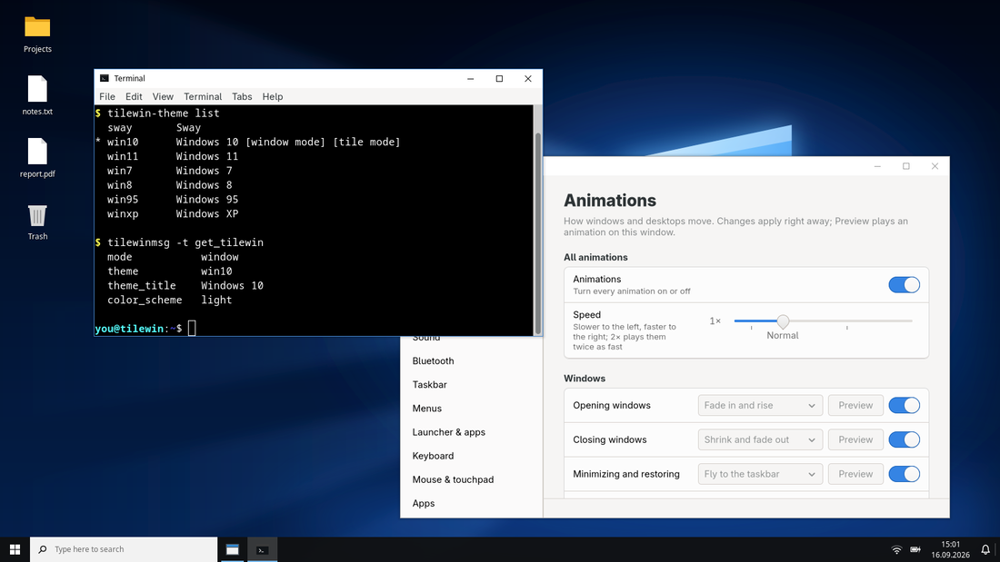

| Start menu | Task view (Super+Tab) |
|---|---|
| 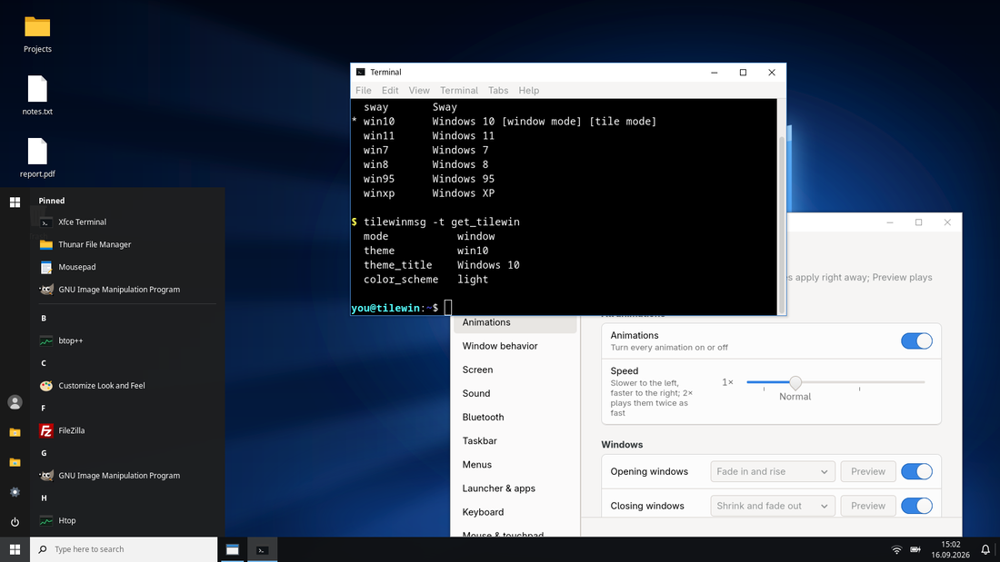 | 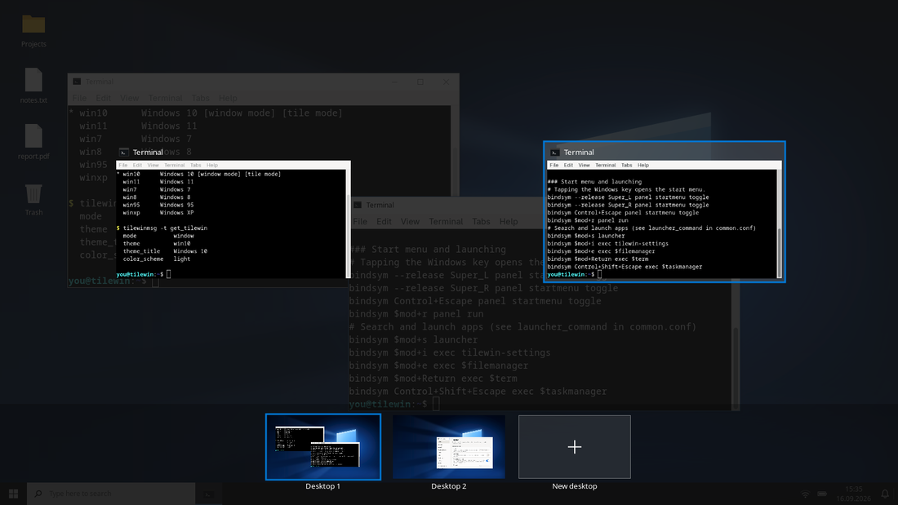 |

Tile mode is sway: the same layouts, the same config, with the theme's tile colors and a status bar.

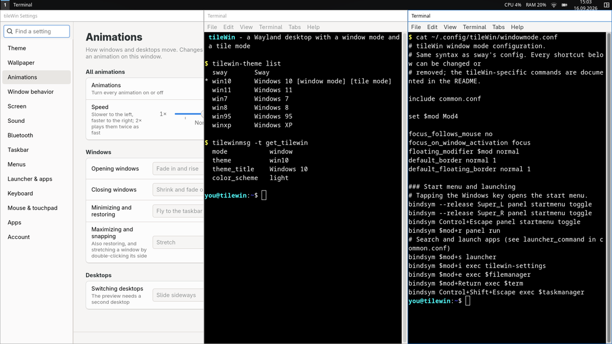

Every theme brings its own title bars, taskbar, start menu and wallpaper:

| Windows 1 | Windows 3 |
|---|---|
| 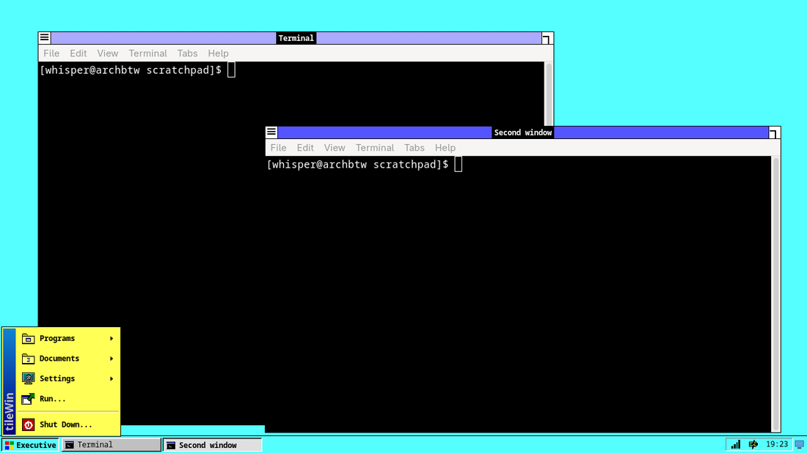 | 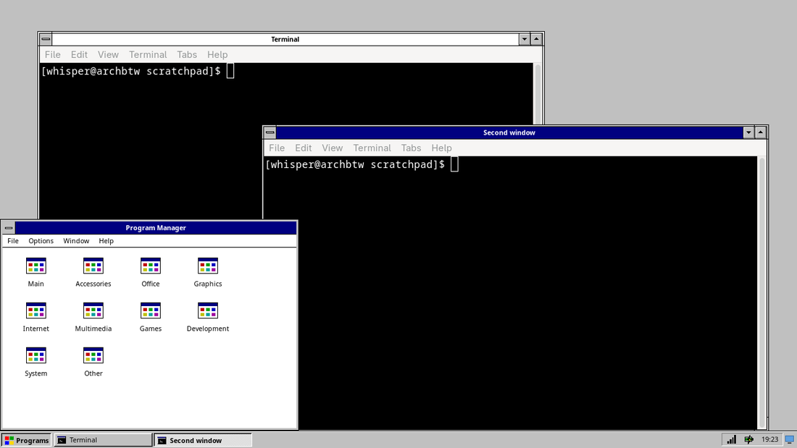 |
| **Windows 95** | **Windows 2000** |
| 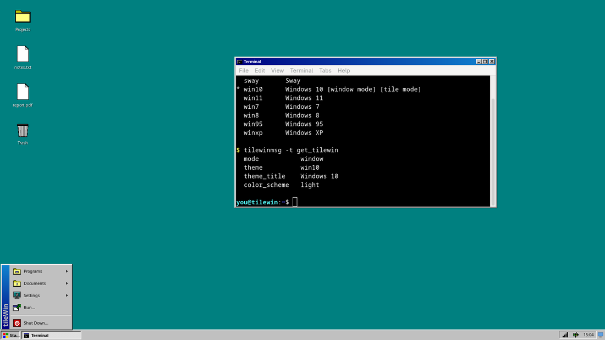 | 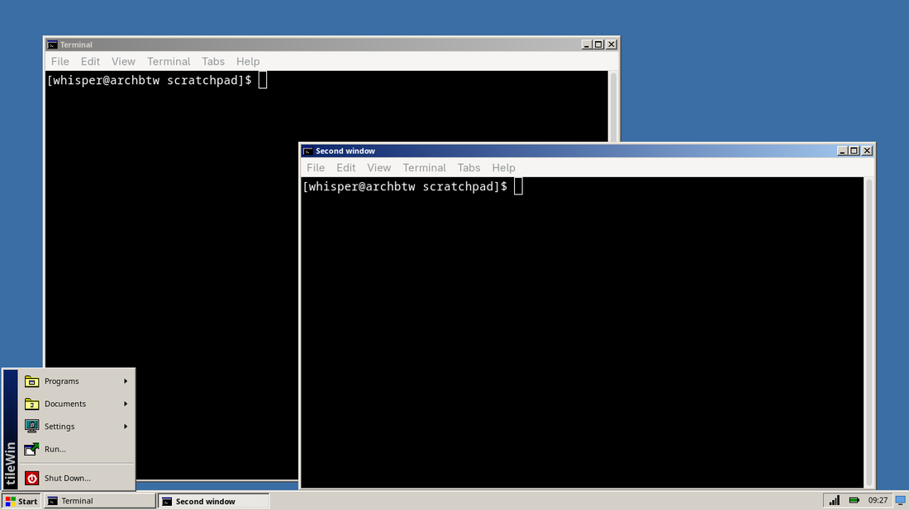 |
| **Windows XP** | **Windows XP (dark)** |
| 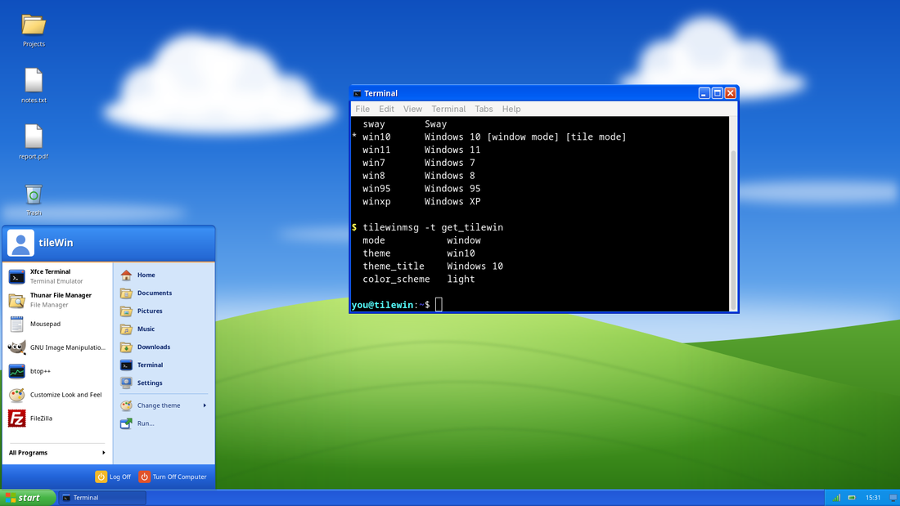 | 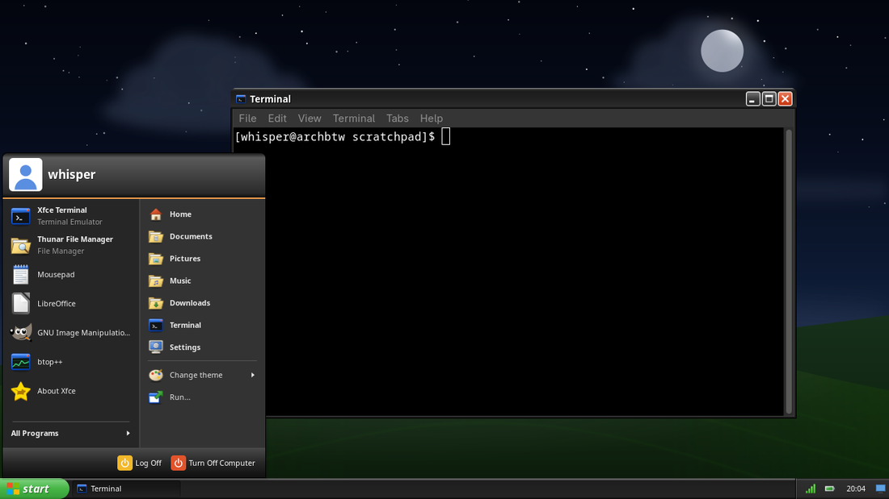 |
| **Windows Vista** | **Windows 7** |
| 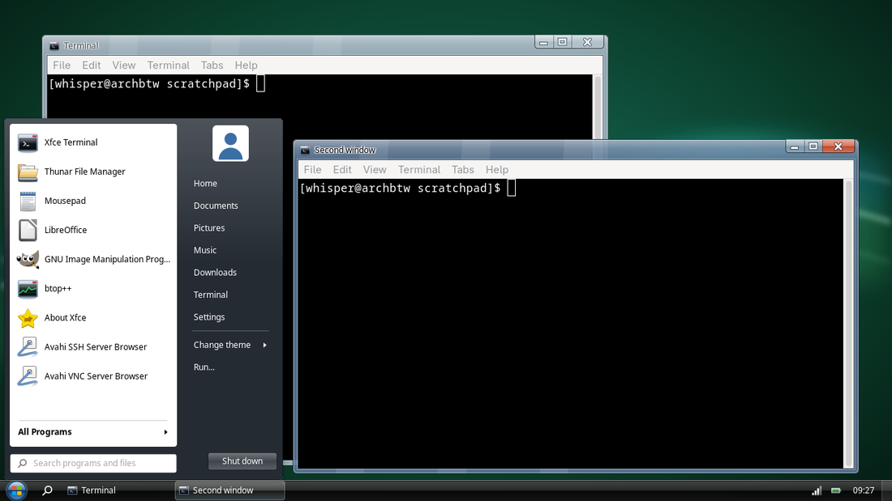 | 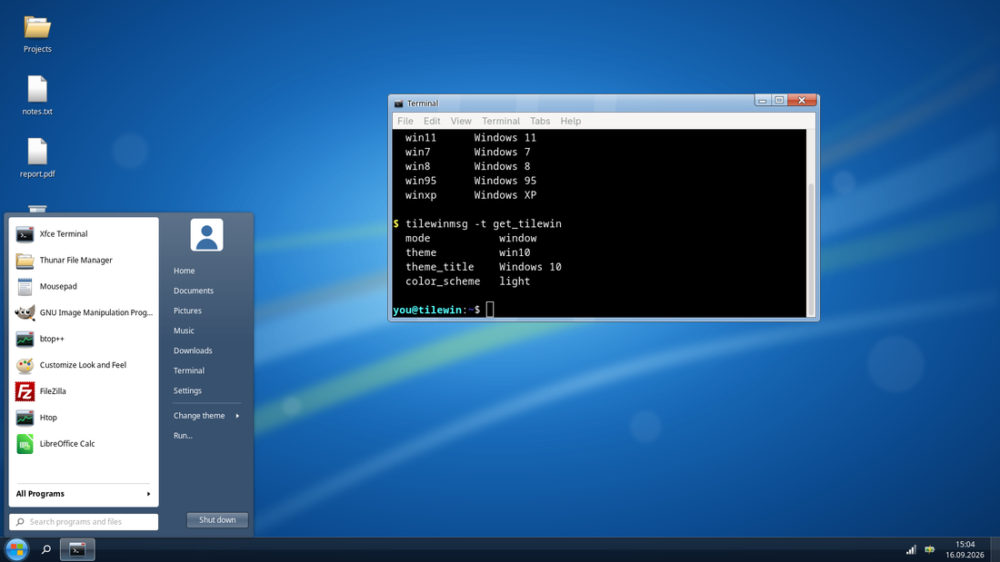 |
| **Windows 8**, its start screen of colored tiles over the whole screen | **Windows 11** |
| 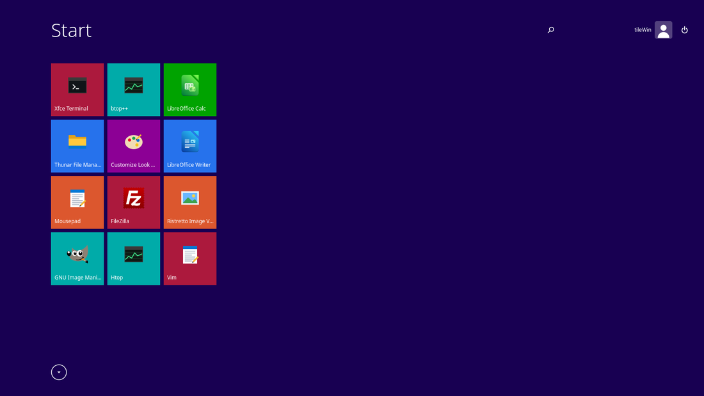 | 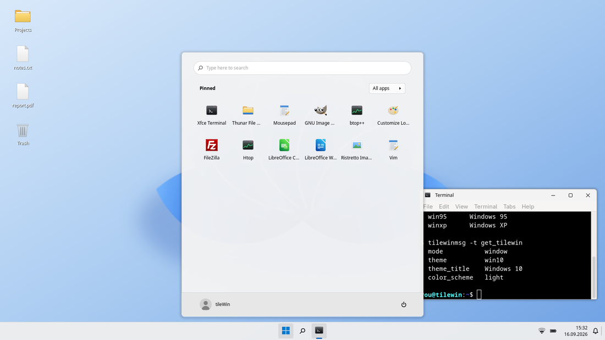 |

Windows 10 is the window mode screenshot at the top.

Windows can be closed with an explosion (`animation close explode`), one of the styles on the Animations page:

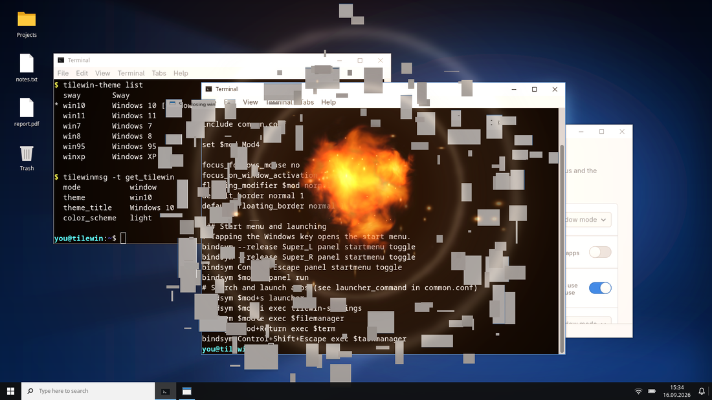

## What it has

- **Two modes, switched live** with Super+Shift+W: tile mode is sway, window mode is Windows. Your windows keep running.
- **Window mode like Windows:** title bars with their buttons, snapping to edges and corners, Snap Layouts, Alt+Tab, Task view with virtual desktops, the window menu and animations.
- **A taskbar** with a start menu, window previews, tray, clock and calendar, quick settings, notifications, and widgets from CPU and network charts to the weather of your own script.
- **A desktop** with icons, and widgets as clocks, charts and gauges.
- **12 themes**, Windows 1 to Windows 11 and sway, each with its own title bars, taskbar, start menu and wallpaper, light or dark, the accent color taken from the wallpaper if you like.
- **Little helpers:** clipboard history, a snipping tool that also reads text, an emoji picker, sticky notes, screen savers, night light and a lock screen.
- **DNS** of its own: the fastest servers, a cache, prefetching and block lists as on a Pi-hole.
- **A settings app** for all of it, so no config file has to be touched.
- **Light:** written in C, no CPU use while nothing happens.

Every feature in detail: [docs/features.md](docs/features.md).

## Installation

```sh
git clone <this repository> tileWin
cd tileWin
./install.sh              # installs dependencies (pacman/apt/dnf), builds and installs to /usr/local
```

Options:

| Option | Effect |
|---|---|
| `--prefix <dir>` | Installation prefix (default `/usr/local`) |
| `--no-deps` | Skip installing dependencies |
| `--debug` | Debug build instead of the optimized LTO release build |
| `--destdir <dir>` | Stage the install into a directory (packaging) |
| `--no-user-config` | Don't create `~/.config/tileWin` |
| `--uninstall` | Remove the installation |

The installer:
- creates `~/.config/tileWin/` with the default config files if they don't exist yet
- registers the **tileWin** session for display managers

Start tileWin:
- choose "tileWin" in your display manager (GDM, SDDM, ly, greetd, ...), or
- run `tilewin-session` from a text console.

**Dependencies:**
- **Required:** wlroots 0.20, wayland, wayland-protocols, libinput, libxkbcommon, libevdev, pixman, libdrm, cairo, pango, gdk-pixbuf2, librsvg, json-c, pcre2, xcb-util-wm, Xwayland, systemd-libs (sd-bus, for the tray), meson and ninja.
- **Optional:** pam (the lock screen is skipped without it), polkit (the password prompt for apps that need an administrator is skipped without it), gtk4 (the settings app is skipped without it), grim, slurp and wl-clipboard (screenshots and the snipping tool), tesseract with its language data (copying text from the screen), pavucontrol/pactl (volume widget), xfce4-terminal and thunar (the default terminal and file manager in the configs), swaylock.

To update:

```sh
git pull && ./install.sh --no-deps && tilewinmsg restart
```

The restart keeps your windows open; an updated compositor itself starts with your next login (or now, with `tilewinmsg restart relaunch-apps`).

## Shortcuts of window mode

| Keys | Action |
|---|---|
| Super (tap) / Ctrl+Esc | Start menu |
| Super+R | Run dialog |
| Super+S | Application launcher |
| Super+I | tileWin Settings |
| Super+E | File manager |
| Super+Return | Terminal |
| Super+D, Super+M | Show desktop |
| Super+L | Lock |
| Super+← / → | Snap the window to the left or right half; pressing the other way unsnaps it again |
| Super+↑ / ↓ | Up maximizes, or lifts a half to the quarter above it; down takes that back, restores a snapped window and minimizes one that is not snapped |
| Alt+Tab, Alt+Shift+Tab | Switch windows (release Alt to confirm, Esc to cancel) |
| Super+Tab | Task view: windows and desktops; drag windows onto another or a new desktop |
| Super+Ctrl+D, Super+Ctrl+F4 | New desktop, close the current desktop |
| Super+Alt+← / → | Move the current desktop left / right in the order |
| Alt+F4 | Close window; on the desktop (or with no window open) the shut down dialog |
| Alt+Space | Window menu |
| Ctrl+Shift+Esc | Task manager |
| Super+1..9 | Activate the n-th taskbar entry |
| Super+Ctrl+← / → | Previous / next virtual desktop |
| Super+Ctrl+Shift+← / → | Move window to previous / next desktop |
| Super+Shift+← / → / ↑ / ↓ | Move window to the monitor beside, above or below |
| Print | Screenshot of all screens to the clipboard and ~/Pictures/Screenshots |
| Win+Shift+S | Snipping tool: rectangle, window or full screen to the clipboard, or **Text**: the text in a rectangle, read with tesseract (in English and the session's language when its data is installed) |
| Super+Shift+W | Switch to tile mode |
| Super+Shift+C | Reload config |
| Super+Shift+Ctrl+R | Restart tileWin |
| Super+Shift+Ctrl+P | Restart the taskbar |
| Ctrl+Alt+Del | Shut down dialog: shut down, restart, sleep, hibernate, hybrid sleep, lock or log out |
| Win+Page Up / Win+Page Down | Maximize / minimize the window |
| Win+A / Win+N | Quick settings / notifications (Action Center) |
| Win+V | Clipboard history |
| Win+. or Win+; | Emoji picker |
| Three fingers up / down on the touchpad | Task view / show the desktop |
| Three fingers left / right on the touchpad | Next / previous desktop |
| Swipe in from the left / right edge of a touchscreen | Task view / notifications |
| Tap / hold a finger still on a touchscreen | Click / right-click (in menus and lists, a finger moved up or down scrolls) |

Tile mode uses sway's default bindings (`$mod` = Super, `$mod+d` opens the launcher) plus `Super+Shift+W` to switch mode, `Super+Shift+Ctrl+R` to restart, the three finger swipes (up: task view, left / right: workspaces) and the touchscreen edge swipes.

## Themes

Pick one in the settings app, from the taskbar menu, or:

```sh
tilewin-theme list
tilewin-theme set winxp
```

Window mode and tile mode each remember their own theme.

## More

- [docs/features.md](docs/features.md): everything tileWin does
- [docs/usage.md](docs/usage.md): keys, flyouts, the settings app, the themes and the screen savers in detail
- [docs/configuration.md](docs/configuration.md): every config file and setting, and how to make a theme of your own
- [docs/development.md](docs/development.md): the tests

## Limitations

- Session restore starts apps again from their command line: terminals come back in their last directory but not with their running programs or scrollback, and documents or tabs only come back if the app restores them itself. Tile mode restores workspaces but not the split layout.
- Microsoft fonts, icons and logos are not included; themes use font fallback lists, drawn glyphs and original look-alike icons.
- There is no background blur, so the Windows 7 glass is translucent only.
- Windows 11 rounds only the frame and title bar; window contents keep square corners.
- Apps that draw their own title bars (GTK4/libadwaita) keep them in window mode.
- Starting a new compositor binary closes running Wayland apps, so `restart` leaves that to the next login (`restart relaunch-apps` does it now and starts the apps again).

## License

MIT. tileWin is based on [sway](https://github.com/swaywm/sway) (MIT, Copyright © 2016-2024 Drew DeVault and contributors).
